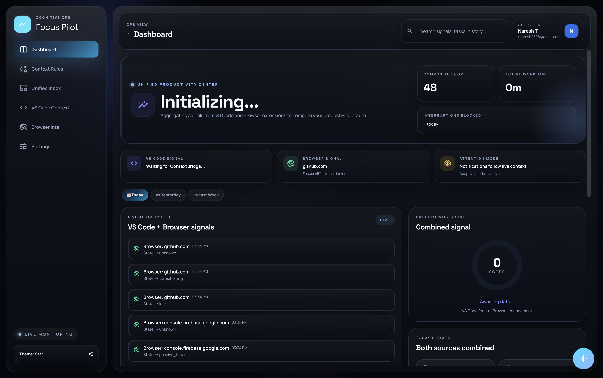

# CodeCrafters: Focus Pilot 🚀

[](https://github.com/SathishNadar/CodeCrafters-AutomationSystem)


> **Master the Attention Economy.** Focus Pilot is a context-aware orchestration layer that reduces distraction by coordinating notifications, actions, and app signals across your entire workflow.



---

## 🌟 The Vision

In a world of constant context-switching, **CodeCrafters** acts as your cognitive assistant. By monitoring signals from your IDE, browser, and communication apps, it builds a real-time "Context Map" of your work. It intelligently suppresses non-urgent notifications during deep work and prioritizes incoming tasks from WhatsApp and Email using advanced AI.

## ✨ Core Features

### 📜 The Core (Desktop Electron Orchestrator)
The central hub for all signals. Visualize your "Deep Focus Score," track your flow state over time, and manage incoming alerts in a clean, glassmorphic interface.

### ⚡ The Pulse (VS Code Context Extension)
A powerful extension that streams developer activity signals:
- **Typing Bursts & Editor Switches**: Tracks when you're deeply "in the zone."
- **Diagnostics Monitor**: Detects when you're stuck on bugs and adjusts focus rules.
- **Bi-directional Notifications**: Receive important system alerts directly in your status bar.

### 🧿 The Sight (Chrome Intelligence Extension)
Stay focused on research. The extension tracks documentation viewing and cross-references it with your coding context to ensure you're on the right track.

### 💬 Intelligent Communication Nodes
- **WhatsApp Monitor**: Consolidates and classifies messages using AI. No more notification spam—just clear, actionable task summaries.
- **Gmail Notifier**: Automates unread email analysis, prioritizing refactor requests, PR reviews, and urgent client feedback.

---

## 🛠️ Tech Stack

- **Frontend**: Electron, Vanilla JS, HTML5/CSS3 (Glassmorphism)
- **Extensions**: VS Code API, Chrome Extension (Manifest V3)
- **Backend**: Node.js, Express, WebSocket
- **AI/ML**: Google Gemini API, HuggingFace Inference, Qwen
- **Integrations**: WhatsApp-Web.js, Google APIs (OAuth2)

---

## 🚀 Getting Started

### Prerequisites

- [Node.js](https://nodejs.org/) (v18+)
- [VS Code](https://code.visualstudio.com/)
- Gmail API credentials (for Email service)

### 1. The Core (Central Hub)
```bash
cd super-app-dashboard
npm install
npm start
```

### 2. The Pulse (VS Code Extension)
1. Open the `ContextBridge` folder in VS Code.
2. Run `npm install`.
3. Press `F5` to open the Extension Development Host.

### 3. The Sight (Web Extension)
1. Navigate to `chrome://extensions`.
2. Enable **Developer Mode**.
3. Click **Load unpacked** and select the `WebExtension` directory.

### 4. Background Services
You can run the monitor services separately or via the dashboard:

**Email Monitor:**
```bash
cd email-notifier-service
npm install
npm start
```

**WhatsApp Monitor:**
```bash
cd whatsapp-monitor-service
npm install
npm start
```

---

## 👥 Contributors

Meet the team behind the magic:

| [<br><sub><b>Sathish Nadar</b></sub>](https://github.com/SathishNadar) | [<br><sub><b>Vrushabh Shirke</b></sub>](https://github.com/Vrushabh-003) | [<br><sub><b>Janhvi Dhale</b></sub>](https://github.com/jdhale) | [<br><sub><b>Naresh T</b></sub>](https://github.com/t-naresh) |
| :---: | :---: | :---: | :---: |

---


<p align="center">Made with passion for CodeCrafters 3.0</p>
